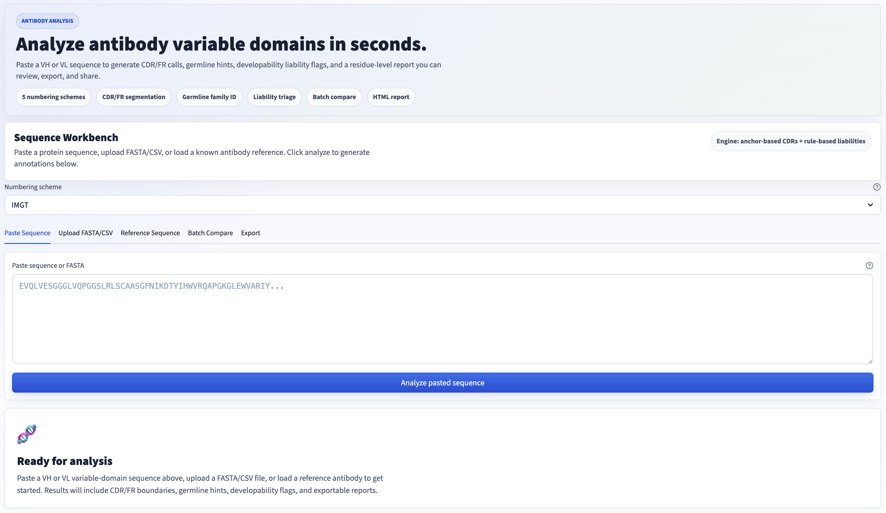

# AbAnnotator

**Web-based antibody variable-domain annotation and developability triage tool.**

<p align="center">
  <a href="https://abannotator.streamlit.app"><strong>Try the live app</strong></a>
  ·
  <a href="https://github.com/hasini-s-de-silva/ab-annotator"><strong>Source code</strong></a>
  ·
  <a href="https://www.linkedin.com/posts/hasini-de-silva_bioinformatics-antibodyengineering-proteindesign-ugcPost-7477695725410217984-DJf3"><strong>Watch the LinkedIn demo</strong></a>
</p>



---

## What It Does

AbAnnotator takes raw VH or VL protein sequences and returns CDR/framework region boundaries, germline gene identification, developability liability flags, batch comparison rankings, and downloadable reports.

Input a sequence by pasting it directly, uploading a FASTA or CSV file, or selecting from a curated panel of 21 sequences from 10 clinically approved monoclonal antibodies (trastuzumab, adalimumab, pembrolizumab, rituximab, and others).

## Features

**Annotation Engine**
- CDR and framework region annotation under five numbering schemes: IMGT (default), Kabat, Chothia, Martin/AbM, AHo
- Automatic chain-type detection for heavy (VH), kappa (VL-kappa), and lambda (VL-lambda) sequences
- Germline V-gene and J-gene identification via reference-sequence matching with motif-level family fallback

**Developability Screening**
- Rule-based liability scanning for deamidation, isomerization, oxidation, N-glycosylation motifs, and polyreactivity risk
- Severity-ranked flags (high, medium, low) with position, motif, and actionable recommendations
- Weighted risk scoring (high x3, medium x2, low x1) for candidate ranking

**Visualisation**
- Colour-coded residue map with position ruler and region tooltips
- SVG domain architecture glyph with CDR/framework boundaries and liability tick markers
- CDR summary cards with sequence and length
- Annotation table showing all FR and CDR regions with highlighted CDR rows

**Batch Analysis**
- Compare multiple sequences side-by-side with ranked risk scoring
- Batch comparison table with germline identity, CDR3 length, and flag breakdown

**Export**
- CSV export (per-CDR rows with liability summary)
- JSON export (structured, machine-readable with regions, liabilities, and risk summary)
- Styled HTML report with candidate comparison table for batch analyses

**Additional Features**
- DNA/RNA input detection with clear error messaging
- Sequence validation with specific feedback (too short, too long, invalid residues)
- Copy-to-clipboard button for annotated sequences
- Session analysis history sidebar
- About/Methods section with scientific context

## Run Locally

```bash
git clone https://github.com/YOUR_USERNAME/AbAnnotator.git
cd AbAnnotator
python -m venv .venv
source .venv/bin/activate
pip install -r requirements.txt
streamlit run app.py
```

The app opens at `http://localhost:8501`.

## Run Tests

```bash
# Unit tests (44 tests across 4 modules)
pytest tests/ -v

# Quick smoke test
python tests/smoke_test.py
```

## Deploy to Streamlit Community Cloud

1. Push this repo to GitHub
2. Go to [share.streamlit.io](https://share.streamlit.io)
3. Sign in with GitHub
4. Click "New app"
5. Select your repo, branch `main`, and main file path `app.py`
6. Click "Deploy"

The app will be live at `https://YOUR-APP.streamlit.app` within a few minutes. Streamlit Cloud installs dependencies from `requirements.txt` automatically.

## Project Structure

```
AbAnnotator/
  app.py                          # Streamlit UI (entry point)
  requirements.txt                # Python dependencies
  src/
    pipeline/
      annotate.py                 # Orchestration: parse -> number -> germline -> liabilities
      parser.py                   # Input parsing (raw, FASTA, CSV) with validation
      numbering.py                # Anchor-based CDR/FR segmentation (5 schemes)
      germline.py                 # V/J gene identification via reference matching
      liabilities.py              # Rule-based developability liability scanning
      export.py                   # CSV, JSON, and HTML report generation
      models.py                   # Data classes (AntibodySequence, AnnotatedAntibody, etc.)
      examples.py                 # Curated therapeutic antibody reference panel
    visualization/
      glyph.py                    # SVG domain architecture diagram
      sequence_view.py            # Colour-coded residue map with position ruler
  tests/
    test_parser.py                # 14 tests: input parsing, validation, DNA detection
    test_numbering.py             # 11 tests: chain detection, CDR/FR boundaries, schemes
    test_liabilities.py           # 8 tests: scanning, severity, deduplication, detection
    test_export.py                # 11 tests: CSV, JSON, HTML report structure
    smoke_test.py                 # End-to-end pipeline verification
  assets/                         # Screenshots and demo visuals
  launch/                         # LinkedIn post copy, demo script, GitHub description
  .streamlit/config.toml          # Theme configuration
```

## Curated Therapeutic Antibody Reference Panel

The reference panel contains 21 variable-domain sequences from 10 clinically approved monoclonal antibodies:

| Category | Antibodies |
|---|---|
| Humanised | Trastuzumab, Bevacizumab, Eculizumab, Natalizumab |
| Fully human | Adalimumab, Pembrolizumab, Nivolumab, Secukinumab |
| Chimeric | Rituximab, Cetuximab |

Chain coverage: 11 VH, 9 VL-kappa, 1 VL-lambda. Eight antibodies have paired VH/VL sequences.

## Technical Architecture

The annotation engine uses anchor-based CDR segmentation with scheme-specific boundary offsets. The pipeline is modular: parsing, numbering, germline assignment, liability scanning, and export are independent modules that can be replaced individually.

```
Raw sequence -> Parser (validate, detect DNA) -> Numbering (CDR/FR boundaries)
  -> Germline (V/J gene match) -> Liabilities (rule-based scan) -> Export (CSV/JSON/HTML)
```

Numbering and germline assignment are isolated in `src/pipeline/numbering.py` and `src/pipeline/germline.py` so that validated external tools can be swapped in without changing the Streamlit UI.

## Scientific Caveats

**This is a working prototype / MVP, not a production replacement for established tools.**

- **Numbering**: The anchor-based CDR segmentation is a heuristic approximation. Production systems should use ANARCI or AbNumber for structure-aware numbering with insertion-code support.
- **Germline assignment**: The reference-matching approach identifies the closest V/J gene family but does not perform allele-level resolution or somatic hypermutation analysis. Production systems should use IgBLAST with the full IMGT/GENE-DB reference.
- **Liability scanning**: The regex-based rules cover common developability liabilities but are not exhaustive. They do not account for structural context (solvent accessibility, burial) that affects real-world liability risk.
- **Validation scope**: The tool is validated against a curated panel of well-characterised therapeutic antibodies. Edge cases (unusual frameworks, heavily mutated sequences, non-standard domains) may produce inaccurate annotations.

## Production Roadmap

Future versions should integrate:

- **ANARCI / AbNumber** for robust, structure-aware antibody numbering with insertion-code support
- **IgBLAST** for allele-level V/D/J gene identification and somatic hypermutation analysis
- **SAbDab / IMGT reference databases** for expanded germline and structural annotation
- **3D structure prediction** integration (ESMFold/AlphaFold) for structure-aware liability assessment
- **Docker containerisation** for reproducible deployment

## Skills Demonstrated

- Python application architecture with modular, testable pipeline design
- Bioinformatics domain knowledge: antibody structure, CDR annotation, germline genetics, developability assessment
- Web application development with Streamlit
- Data visualisation: custom SVG generation, interactive residue maps, styled tables
- Scientific software engineering: validation, caveats, reproducibility
- Export pipeline: multi-format report generation (CSV, JSON, HTML)
- Test suite design: unit tests across parsing, numbering, liability scanning, and export modules

## License

MIT License. See [LICENSE](LICENSE) for details.
